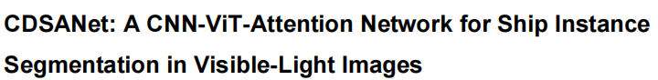
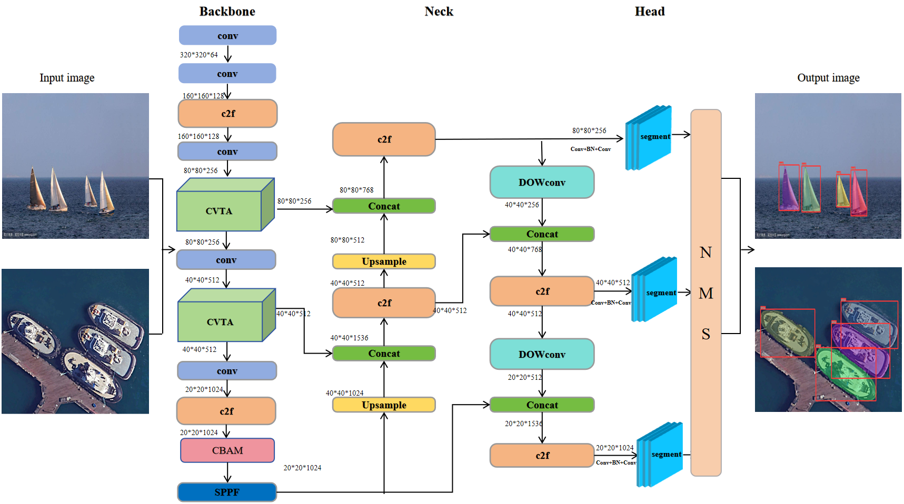
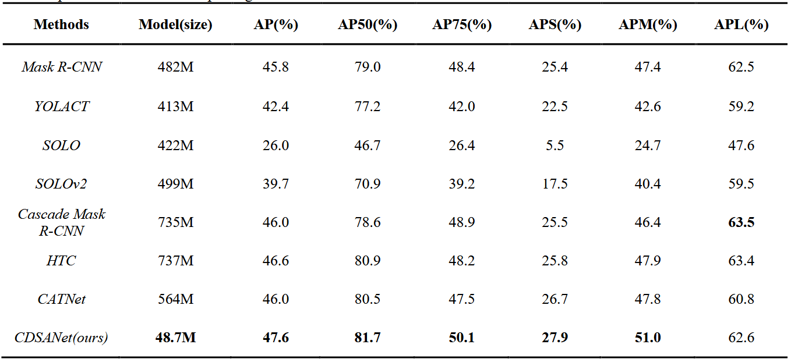
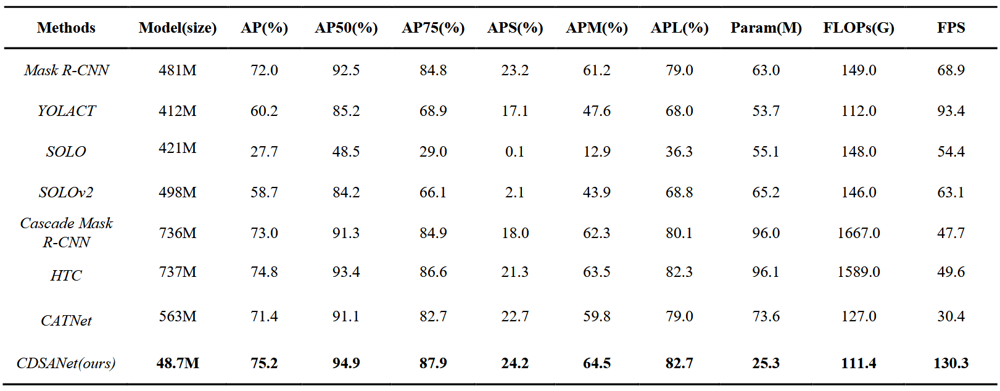

Key requirements:
  window11 system
  PyTorch ==2.0.0
  CUDA ==12.6
  mmcv==1.6.2
  numpy==1.23.2
  python==3.18.7
  torchvision==0.13.0

Dataset Preparation:

    mydata/
    
     ├── train/
     
        ├── images/
        
        ├── labels/
        
     ├── val/
     
        ├── images/
        
        ├── labels/
     
Training

  To train CDSANet model with original settings of our paper, run:

      python train.py
      
Performance on MarishipInSseg:

      
Performance on VLRSSD:

  
Key Components:
    This study introduces CVTA, a hybrid module combining convolutional layers, SE blocks , and Vision Transformer components to enhance feature representation. Compared with the original MobileViT-V3, CVTA adopts a multi-branch structure that explicitly splits, processes, and fuses features, enabling richer local-global interactions. It integrates convolutional and transformer operations via the Mv3Block and MBTransformer, achieving improved segmentation accuracy with manageable complexity. Experimental analysis shows that replacing two backbone C2f modules with CTMvitbv3 offers the best trade-off between performance and efficiency.To enhance the neck's feature extraction, we propose DOWConv, inspired by DOConv . It dynamically generates convolutional kernels using two weight matrices—a base and a dynamic matrix—allowing the network to adaptively capture fine-grained features such as edges and contours. DOWConv improves representation while keeping computational cost low through weight sharing and lightweight design.For bounding box regression, the Scalable IoU (SIoU) loss replaces CIoU to improve localization accuracy. SIoU incorporates center distance, angle, and aspect ratio into the loss function, enabling better alignment between predicted and ground truth boxes, especially in complex maritime scenes.Finally, two attention mechanisms are integrated: CBAM, applied before the SPPF module to enhance spatial focus in cluttered regions; and SE blocks, embedded within CVTA and DOWConv to recalibrate channel-wise features without adding significant overhead.

For questions or collaboration, feel free to contact:

Corresponding author: Piao Wang  (m230200742@st.shou.edu.cn)

Please cite our work if you find it useful:
  title={CDSANet: A CNN-ViT-Attention Network for Ship Instance Segmentation in Visible-Light Images},
  author={Zhu, Weidong and Wang, Piao and Xie, Qidi and Luo, Junjie and Niu, Chenrui},
  journal={The Visual Computer}
  

